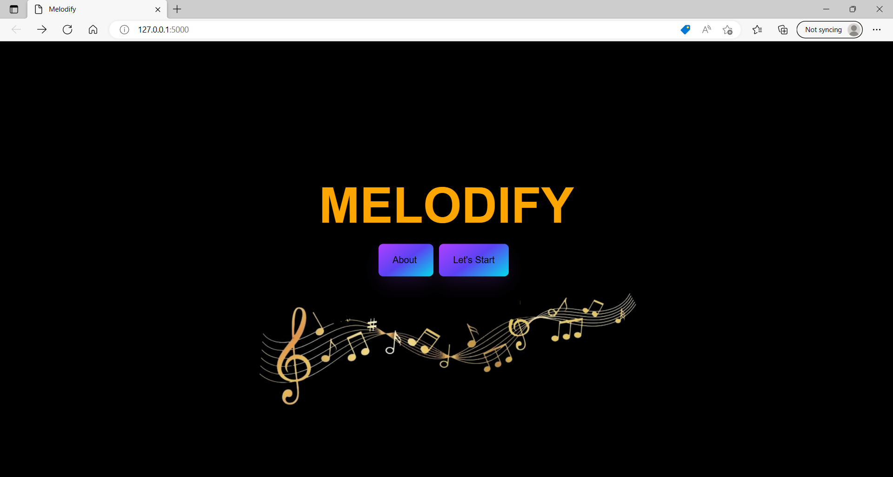
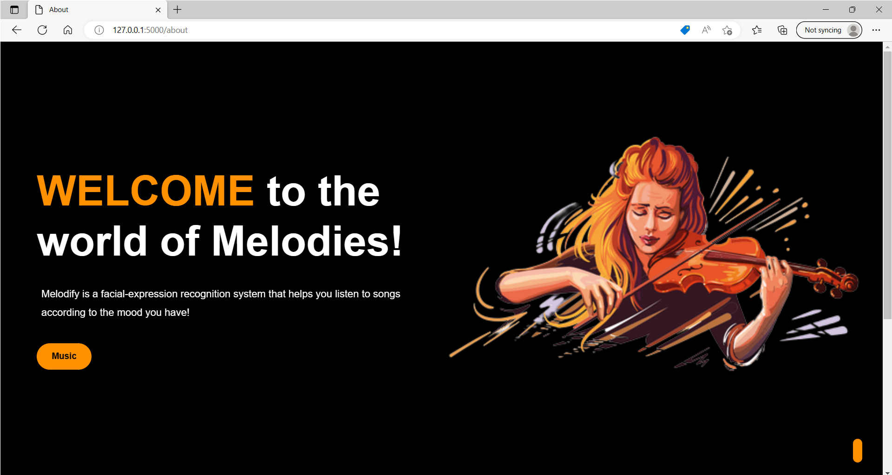
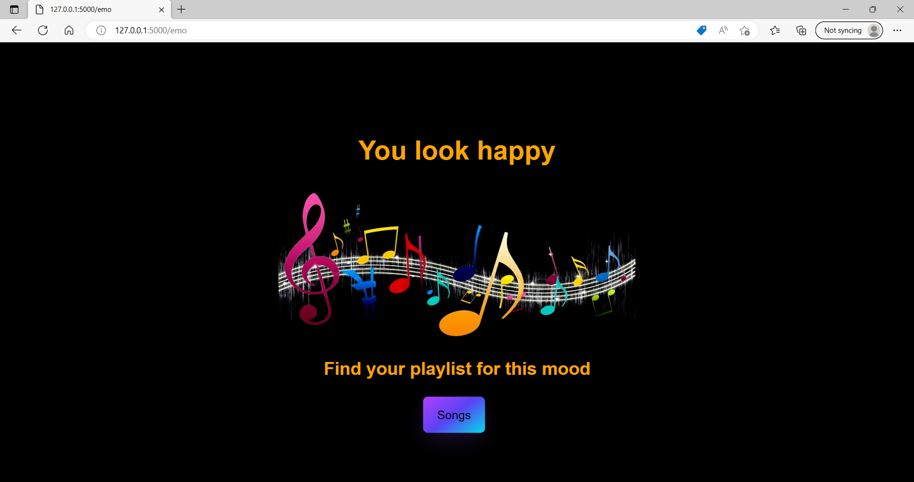
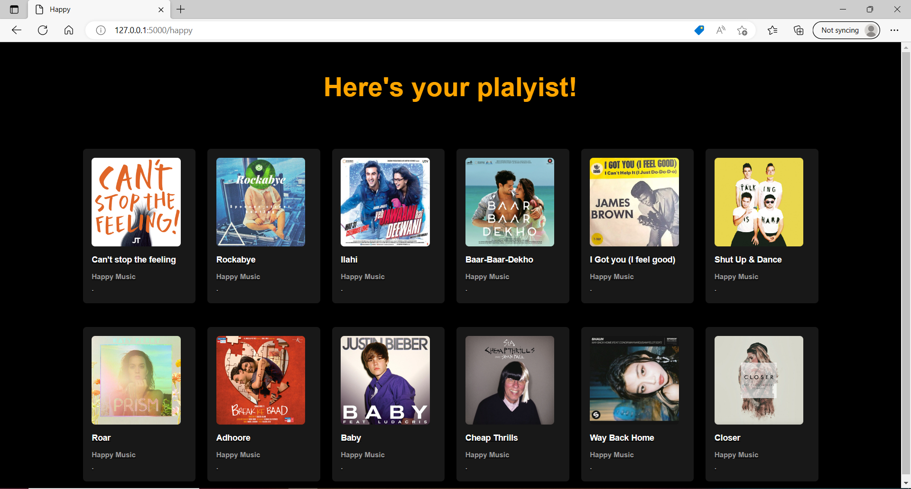
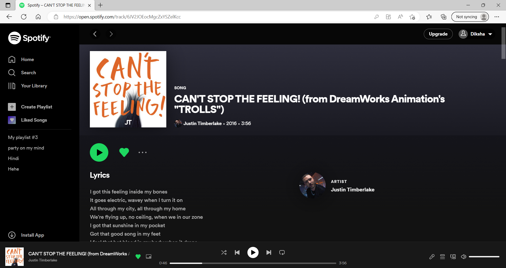

# Melodify 	

**Melodify** is a web application which is a facial expression recognition-based music suggestion website that cheers up users and saves time while searching for a song that matches their mood.
1. It recognizes facial expression based on the 7 categories i.e., angry, sad, fear, happy, disgust, surprise and neutral.
2. Based on the emotion it shows playlist to the user.
3. When user clicks on songs it redirects them to Spotify website.
4. Enjoy songs !

## Tech Stack
**Frontend :** `Html, css, Javascript` 
**Backend :** `Python, Flask` 
**Libraries :** `Numpy, cv2, statistics, tensorflow, keras` 

## Demo
**This is the start page :**
  

**About Page:**
  

**Click on "Lets start" button:**
  

**Detected emotion : Happy**
  

**Playlist for "Happy" mood**
  

**Enjoy the song on spotify !!😊**
  

## Challenges we ran into
It was a challenging task to get the website to access 7 song templates from the songs button based on the emotion recognized. Dynamic links were used as a means to access the templates for the songs corresponding to the output of the model.

## What's next for **Melodify**
The next step is to further improve the model's accuracy and enhance the UI/UX of the web app.
